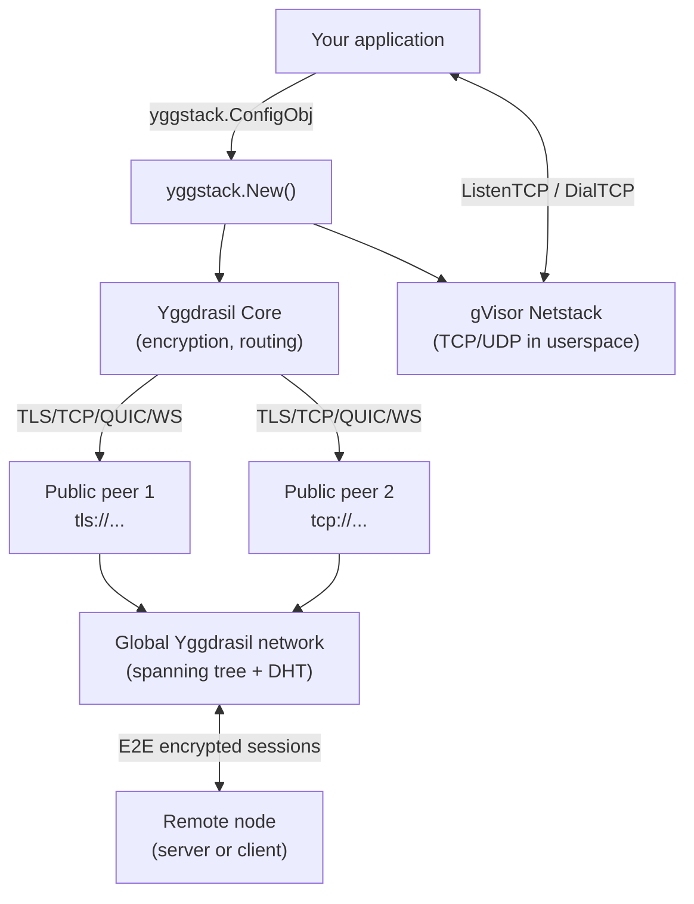
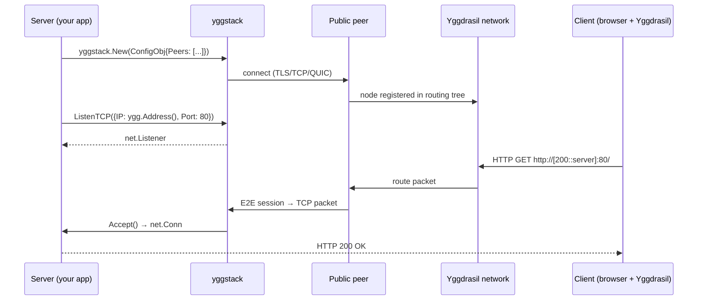
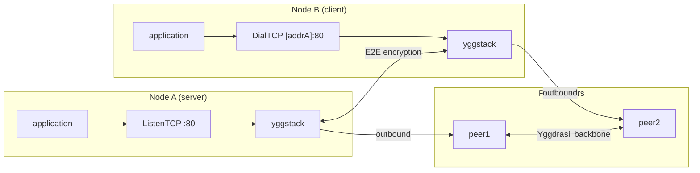
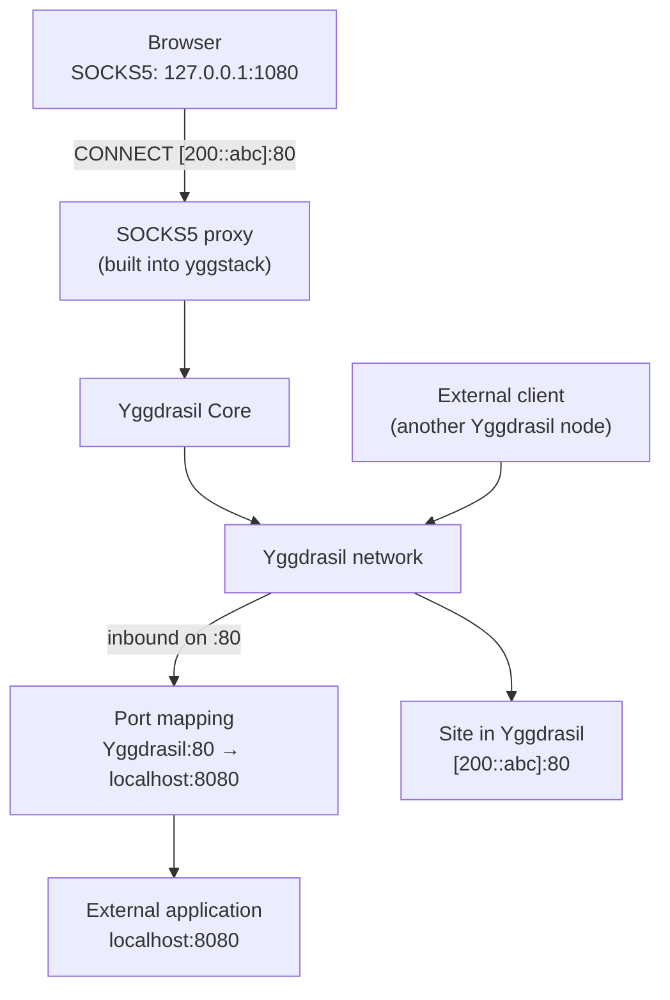
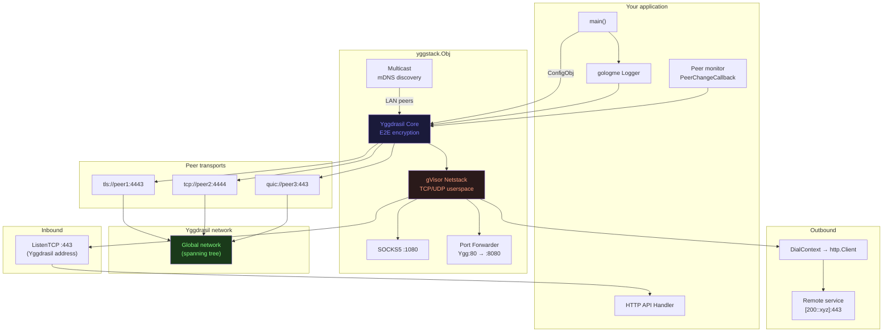

# Embedding yggstack in Go Applications

yggstack is a library that lets you embed a full [Yggdrasil](https://yggdrasil-network.github.io/)
network node directly inside your Go application. No TUN adapter, no root
access, no separate daemon — everything runs in userspace via the bundled
gVisor network stack.

> **Important:** Yggdrasil is an overlay network not designed for high
> throughput. Bandwidth is constrained by per-hop encryption and routing
> through public peers — typically tens of megabits in practice. Use yggstack
> for moderate-traffic scenarios: remote management, monitoring, secure access,
> P2P communication. It is not suitable for HD video streaming or
> high-frequency APIs.

---

## Contents

1. [Installation](#installation)
2. [Quick start](#quick-start)
3. [ConfigObj — all fields](#configobj--all-fields)
4. [Obj methods](#obj-methods)
5. [Usage patterns](#usage-patterns)
    - [Server — accepting incoming connections](#server--accepting-incoming-connections)
    - [Client — outbound connections](#client--outbound-connections)
    - [Port forwarding](#port-forwarding)
    - [SOCKS5 proxy](#socks5-proxy)
    - [Full configuration](#full-configuration)
6. [Examples in cmd/embedded](#examples-in-cmdembedded)
7. [Architecture diagrams](#architecture-diagrams)
8. [Addressing: finding another node](#addressing-finding-another-node)
9. [Network limitations](#network-limitations)

---

## Installation

```bash
go get github.com/yggdrasil-network/yggstack
```

```go
import "github.com/yggdrasil-network/yggstack/mod/yggstack"
```

If you are working from a local copy of the repository, add a replace
directive to your `go.work` or `go.mod`:

```
replace github.com/yggdrasil-network/yggstack => /path/to/yggstack
```

---

## Quick start

```go
package main

import (
	"context"
	"fmt"
	"net"
	"net/http"

	yggconfig "github.com/yggdrasil-network/yggdrasil-go/src/config"
	"github.com/yggdrasil-network/yggstack/mod/yggstack"
)

func main() {
	ctx := context.Background()

	cfg := yggconfig.GenerateConfig()
	cfg.AdminListen = "none"
	cfg.Peers = []string{"tls://publicpeer.example.com:4443"}

	ygg, err := yggstack.New(yggstack.ConfigObj{
		Ctx:    ctx,
		Config: cfg,
	})
	if err != nil {
		panic(err)
	}
	defer ygg.Close()

	fmt.Println("Yggdrasil address:", ygg.Address())

	// Listen for incoming HTTP connections over Yggdrasil.
	l, err := ygg.ListenTCP(&net.TCPAddr{IP: ygg.Address(), Port: 80})
	if err != nil {
		panic(err)
	}
	http.Serve(l, http.HandlerFunc(func(w http.ResponseWriter, r *http.Request) {
		fmt.Fprintln(w, "hello from Yggdrasil")
	}))
}
```

---

## ConfigObj — all fields

```go
type ConfigObj struct {
// Application context. Cancelling it triggers a graceful shutdown.
// Default: context.Background()
Ctx context.Context

// Yggdrasil node configuration: keys, peers, listen addresses.
// Generate a baseline config with yggconfig.GenerateConfig().
// Default: random keys, no peers
Config *config.NodeConfig

// Logger for internal node messages (levels: trace/debug/info/warn/error).
// core.Logger is compatible with gologme/log out of the box.
// Default: no-op (all log output discarded)
Logger core.Logger

// Logger that enables mDNS peer discovery on the local network.
// Set to nil to disable multicast entirely.
// Default: nil
MulticastLogger *golog.Logger

// Address for the built-in SOCKS5 proxy over Yggdrasil.
// Accepts a TCP address ("127.0.0.1:1080") or a UNIX socket path ("/tmp/yggstack.sock").
// Default: "" (SOCKS5 disabled)
SocksAddr string

// DNS server inside the Yggdrasil network for resolving .ygg domains.
// Format: "[ygg-ipv6]:53"
// Default: "" (DNS disabled)
Nameserver string

// Enable verbose per-connection logging for the SOCKS5 proxy.
// Default: false
SocksVerbose bool

// Port forwarding rules (TCP/UDP, inbound and outbound).
// Default: all lists empty
Mapping MappingConfigObj

// Inactivity timeout for UDP forwarding sessions.
// Default: 120 seconds
UDPSessionTimeout time.Duration

// Callback fired on connection create, data transfer, and close events.
// Required for LowPower mode to function correctly.
// Default: nil
ActivityCallback activity.CallbackInterface

// Callback fired when the number of connected peers changes.
// Default: nil
PeerChangeCallback peers.ChangeCallbackInterface

// Timeout for stopping the Yggdrasil core.
// Critical on network switches (Wi-Fi → mobile): without a timeout,
// core.Stop() can hang for tens of seconds waiting for stuck phony actors.
// Default: 0 (no limit)
CoreStopTimeout time.Duration

// Low-power mode configuration.
// When set, the node suspends itself while there are no active connections.
// Default: nil (disabled)
LowPower *lowpower.ConfigObj
}
```

### MappingConfigObj

```go
type MappingConfigObj struct {
// Forward a remote Yggdrasil port to a local address (like ssh -L).
// Example: listen on 127.0.0.1:8080, connect to [200::1]:80
LocalTCP []types.TCPMapping
LocalUDP []types.UDPMapping

// Expose a local service on the node's Yggdrasil address (like ssh -R).
// Example: accept on Yggdrasil:80, proxy to 127.0.0.1:8080
RemoteTCP []types.TCPMapping
RemoteUDP []types.UDPMapping
}
```

---

## Obj methods

### Node information

```go
// Node's IPv6 address in the Yggdrasil network (200::/7 range).
// Deterministic: derived from the node's public key.
ygg.Address() net.IP

// Node's /64 routed subnet (300::/7 range).
ygg.Subnet() net.IPNet

// Node's Ed25519 public key (32 bytes).
ygg.PublicKey() ed25519.PublicKey
```

### Listening (server side)

```go
// Accept incoming TCP connections on the node's Yggdrasil address.
ygg.ListenTCP(&net.TCPAddr{IP: ygg.Address(), Port: 443})

// Accept incoming UDP packets on the node's Yggdrasil address.
ygg.ListenUDP(&net.UDPAddr{IP: ygg.Address(), Port: 53})
```

### Dialing (client side)

```go
// Open a TCP connection to another Yggdrasil node.
ygg.DialTCP(&net.TCPAddr{IP: remoteIP, Port: 80})

// Open a UDP connection to another Yggdrasil node.
ygg.DialUDP(&net.UDPAddr{IP: remoteIP, Port: 53})

// General-purpose dial, compatible with http.Transport.DialContext.
ygg.DialContext(ctx, "tcp", "[200::1]:80")
```

### Peer management

```go
// Current peer list with connection metrics.
ygg.GetPeers() []peers.InfoObj

// Same, as JSON.
ygg.GetPeersJSON() ([]byte, error)

// Add a peer at runtime.
ygg.AddPeer("tls://peer.example.com:4443")

// Remove a peer at runtime.
ygg.RemovePeer("tls://peer.example.com:4443")

// Immediately retry all disconnected peers.
ygg.RetryPeersNow()
```

### Lifecycle

```go
// Gracefully shut down the node. Safe to call multiple times.
ygg.Close()
```

---

## Usage patterns

### Server — accepting incoming connections

The application publishes a service on the Yggdrasil network. Clients reach it
by the node's Yggdrasil IPv6 address, which is derived deterministically from
the public key.

```go
cfg := yggconfig.GenerateConfig()
cfg.Peers = []string{"tls://peer.example.com:4443"}
// Pin the address by providing a stable private key:
// cfg.PrivateKey = loadKeyFromFile(...)

ygg, _ := yggstack.New(yggstack.ConfigObj{Ctx: ctx, Config: cfg})
defer ygg.Close()

l, _ := ygg.ListenTCP(&net.TCPAddr{IP: ygg.Address(), Port: 443})
http.Serve(l, myHandler)
```

> If `PrivateKey` is not set, a new key pair is generated on every start and
> the node's address changes. Persist the key between runs to keep a stable address.

### Client — outbound connections

The application connects to a server inside the Yggdrasil network. The
server's address is computed from its public key:

```go
import "github.com/yggdrasil-network/yggdrasil-go/src/address"

pubKeyBytes, _ := hex.DecodeString("02a7ce8ef67ed158da52e10bf5a02463089fec36c875305f9da215c4f6b066ff")
addr := address.AddrForKey(ed25519.PublicKey(pubKeyBytes))
serverIP := net.IP(addr[:])

// Use ygg as the transport for http.Client.
client := &http.Client{
Transport: &http.Transport{DialContext: ygg.DialContext},
}
resp, _ := client.Get(fmt.Sprintf("http://[%s]:443/api", serverIP))
```

### Port forwarding

**Expose an existing local HTTP server on the Yggdrasil network** without
touching its code:

```go
ygg, _ := yggstack.New(yggstack.ConfigObj{
Ctx:    ctx,
Config: cfg,
Mapping: yggstack.MappingConfigObj{
// Yggdrasil:80 → localhost:8080
RemoteTCP: []types.TCPMapping{{
Listen: net.TCPAddr{Port: 80},
Mapped: net.TCPAddr{IP: net.ParseIP("127.0.0.1"), Port: 8080},
}},
},
})
```

**Access a remote Yggdrasil service through a local port:**

```go
ygg, _ := yggstack.New(yggstack.ConfigObj{
Ctx:    ctx,
Config: cfg,
Mapping: yggstack.MappingConfigObj{
// localhost:8080 → [ygg-server]:80
LocalTCP: []types.TCPMapping{{
Listen: net.TCPAddr{IP: net.ParseIP("127.0.0.1"), Port: 8080},
Mapped: net.TCPAddr{IP: serverYggIP, Port: 80},
}},
},
})
```

### SOCKS5 proxy

Any browser or application that supports SOCKS5 gains full access to the
Yggdrasil network:

```go
ygg, _ := yggstack.New(yggstack.ConfigObj{
Ctx:        ctx,
Config:     cfg,
SocksAddr:  "127.0.0.1:1080",
Nameserver: "[324:71e:281a:9ed3::53]:53", // DNS for .ygg domains
})
// curl -x socks5h://127.0.0.1:1080 http://example.ygg/
```

### Full configuration

All features at once: server, client, SOCKS5, port forwarding, monitoring,
and clean shutdown on network changes:

```go
logger := golog.New(os.Stdout, "", golog.LstdFlags)
logger.EnableLevel("info")
logger.EnableLevel("warn")
logger.EnableLevel("error")

cfg := yggconfig.GenerateConfig()
cfg.AdminListen = "none"
cfg.Peers = []string{
"tls://peer1.example.com:4443",
"tcp://peer2.example.com:4444",
}
cfg.PrivateKey = loadKey() // stable address across restarts

ygg, err := yggstack.New(yggstack.ConfigObj{
Ctx:             ctx,
Config:          cfg,
Logger:          logger,
CoreStopTimeout: 5 * time.Second, // don't hang on network switch
SocksAddr:       "127.0.0.1:1080",
Nameserver:      "[324:71e:281a:9ed3::53]:53",
Mapping: yggstack.MappingConfigObj{
RemoteTCP: []types.TCPMapping{{
Listen: net.TCPAddr{Port: 80},
Mapped: net.TCPAddr{IP: net.ParseIP("127.0.0.1"), Port: 8080},
}},
},
PeerChangeCallback: myPeerMonitor,
ActivityCallback:   myActivityTracker,
})
defer ygg.Close()

// Simultaneously run a native server on the node's Yggdrasil address.
l, _ := ygg.ListenTCP(&net.TCPAddr{IP: ygg.Address(), Port: 443})
go http.Serve(l, apiHandler)
```

---

## Examples in cmd/embedded

### [tiny-http](cmd/embedded/tiny-http/)

A minimal HTTP server demonstrating the core pattern: start a node, get its
address, bind a `net.Listener` on the Yggdrasil address.

- Single hardcoded peer
- Two HTTP servers: plain TCP (port 8080) and Yggdrasil (port 8080)
- No configuration file
- ~60 lines of code

**Start here** when learning the API.

---

### [http](cmd/embedded/http/)

A production-grade HTTP server that publishes a website on the Yggdrasil
network, with a built-in web dashboard.

- YAML config (`conf.yml`): private key, peers, ports
- Two HTTP servers: plain TCP + Yggdrasil (zstd compression, ETag/304,
  chunked transfer for files > 250 KB)
- `/yggdrasil-server.json` — node metrics: peers, bandwidth, uptime, sessions
  (10-second cache)
- `/ygg-qr.png` — QR code of the Yggdrasil address for mobile devices
- Web UI: peer status, RX/TX graph, node info panel
- Logs the auto-generated private key so it can be persisted in `conf.yml`

**Use as a template** when building real web applications with Yggdrasil.

---

### [tiny-chat](cmd/embedded/tiny-chat/)

A P2P command-line chat between two Yggdrasil nodes over HTTP.

- Interactive setup: user provides a peer URI and the remote public key
- Message exchange via `/input` endpoint
- Remote address derived from the public key via `address.AddrForKey()`
- Demonstrates `ygg.DialContext` as a drop-in transport for `http.Client`

**Use this example** to understand P2P communication and public-key addressing.

---

### [mobile](cmd/embedded/mobile/)

A gomobile binding layer for iOS and Android.

- Full API expressed through plain Java/Swift-compatible types
- Lifecycle: `Start()` / `Stop()` / `IsRunning()`
- Callback interfaces: `LogCallback`, `PeerChangeCallback`
- Runtime peer and port-mapping management
- QUIC RTT probe: `CheckQuicRTT(uri)`
- Log levels: trace / debug / info / warn / error

**Build commands:**

```bash
gomobile bind -target=android -o yggstack.aar .
gomobile bind -target=ios -o Yggstack.xcframework .
```

---

## Architecture diagrams

### Basic: a node in the network



---

### Scenario: HTTP server inside Yggdrasil



---

### Scenario: P2P communication (client ↔ server)



---

### Scenario: SOCKS5 + port forwarding



---

### Full configuration



---

## Addressing: finding another node

A node's Yggdrasil address is derived deterministically from its Ed25519
public key. If you know the remote node's public key, you can compute its
address locally without any network lookup:

```go
import (
"crypto/ed25519"
"encoding/hex"
"github.com/yggdrasil-network/yggdrasil-go/src/address"
)

pubKeyHex := "02a7ce8ef67ed158da52e10bf5a02463089fec36c875305f9da215c4f6b066ff"
pubKeyBytes, _ := hex.DecodeString(pubKeyHex)

addr := address.AddrForKey(ed25519.PublicKey(pubKeyBytes))
ip := net.IP(addr[:]) // the node's Yggdrasil IPv6 address
```

To get your own node's public key: `hex.EncodeToString(ygg.PublicKey())`

---

## Network limitations

| Property    | Reality                                          |
|-------------|--------------------------------------------------|
| Throughput  | Tens of megabits (varies by route length)        |
| Latency     | 50–500 ms through public peers                   |
| Scale       | Experimental network — not production-grade      |
| Load        | Not designed for high-frequency or bulk requests |
| Reliability | No SLA guarantees                                |

**Recommendations:**

- Cache expensive operations (metrics, peer lists) — do not poll faster than once per second
- Set timeouts on all outbound connections
- Use `CoreStopTimeout` to avoid hangs when the host switches networks
- Do not use for streaming or high-throughput APIs
- Design for degradation: the Yggdrasil channel may be temporarily unavailable
